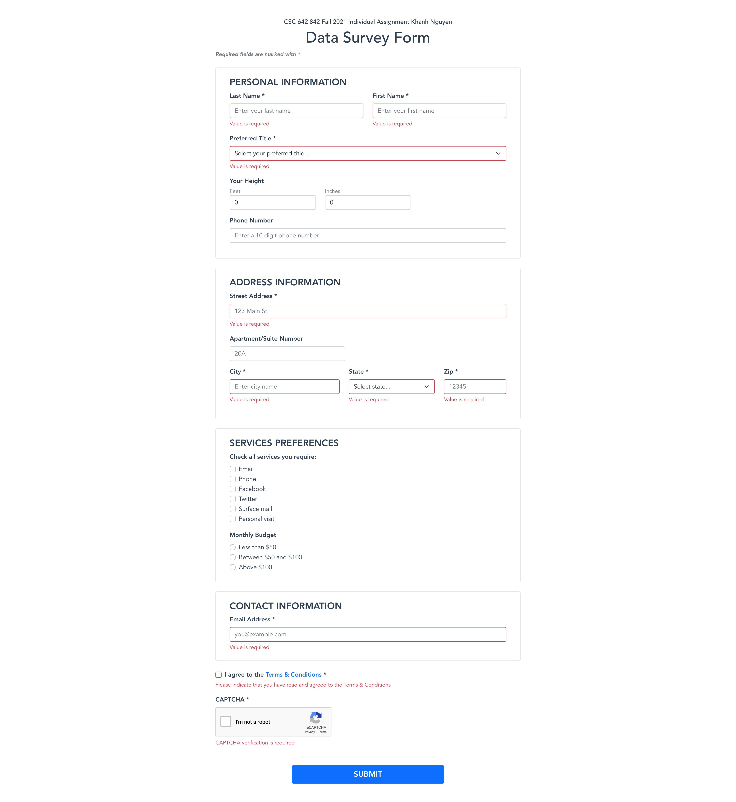
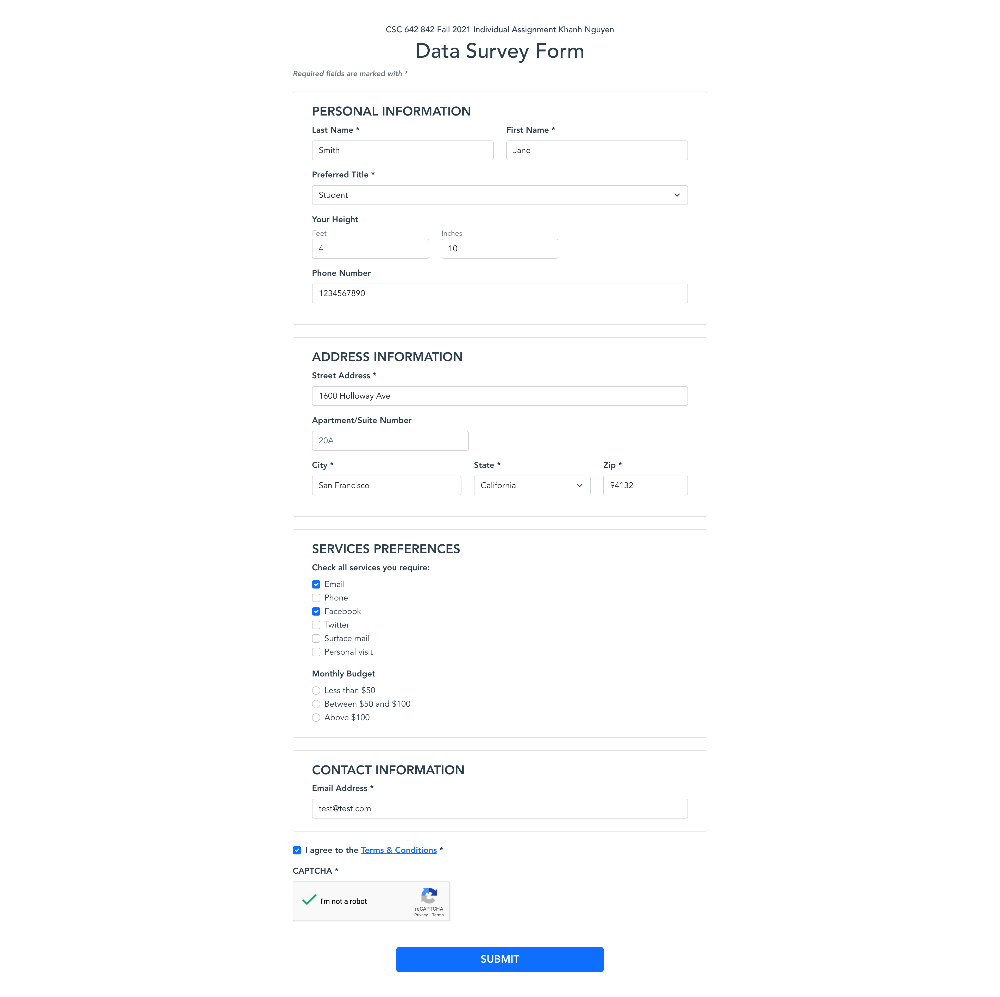
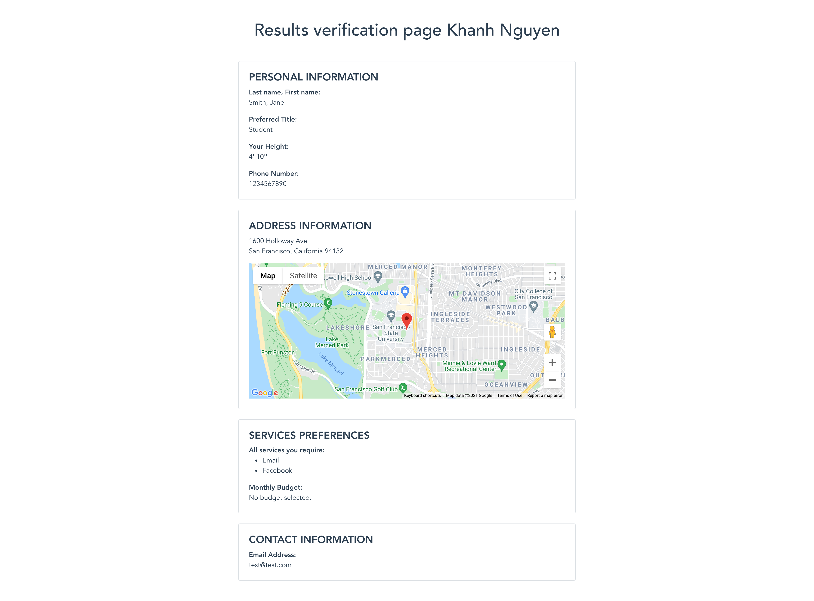
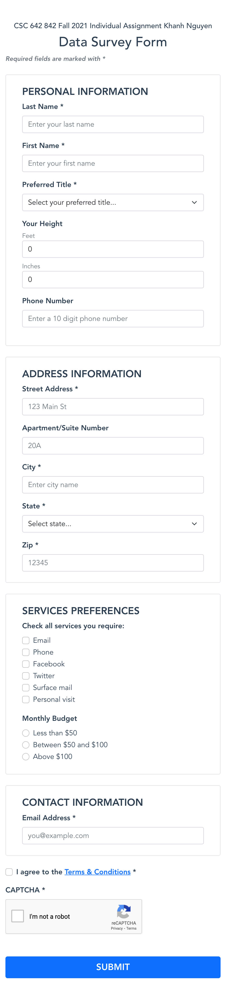
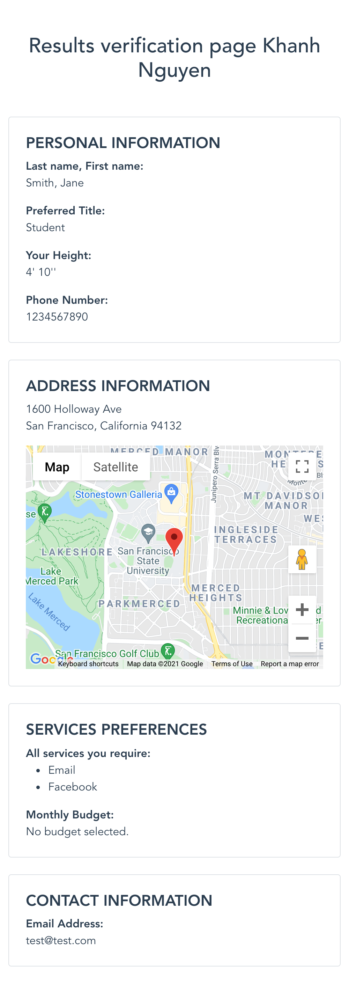

# CSC 642-842 Fall 2021 Individual Assignment - Khanh Nguyen

### CSC 642-842: Human-Computer Interaction

## Demo
https://khanhngg.github.io/csc642-842-fall21-project/

## Project description
A data survey form and result page using Vue.js and Bootstrap.

## Documentation
### Frameworks:
* [Vue.js v3](https://v3.vuejs.org/)
* [Bootstrap v5.1](https://getbootstrap.com/)

### Field validation:
* [Vuelidate](https://vuelidate.js.org/)

### Maps:
* [Google Maps API](https://developers.google.com/maps/documentation/javascript/overview)
* [Google Geocoding API](https://developers.google.com/maps/documentation/geocoding/overview)
* [@fawmi/vue-google-maps](https://vue-map.netlify.app/)

### CAPTCHA:
* [Google reCAPTCHA v2](https://developers.google.com/recaptcha/docs/display)

### Hosting:
* GitHub Pages

## Screenshots

